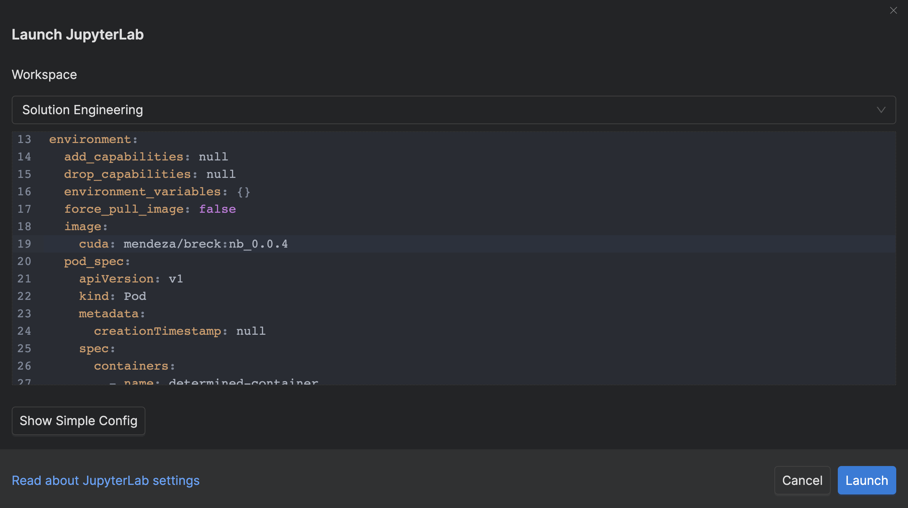

# pdk-obj-det-demo
Demo running End to End MLOPS using Determined, Pachyderm, and Kserve. Demo runs Object Detection on Xview Dataset
# Step 1: Prepare Environment 
* Create Jupyterlab instance on MLDS cluster with resource pool T4 or A100
* Select one GPU in jupyterlab environment
* Use docker container: `mendeza/breck:nb_0.0.5`

See screenshot below:



# Step 2: Setup and install
* Open Terminal
* `git clone https://github.com/interactivetech/pdk-obj-det-demo.git`
* `cd pdk-obj-det-demo/`
* `git clone http://github.com/interactivetech/pdk-use-cases-dev.git`

* Go to MLDM: http://mldm-pachyderm.us.rdlabs.hpecorp.net/ , make sure there is a project called object-detection-demo
* open the object-detection-demo project in MLDM and make sure all the pipelines (and repos) are deleted. We will create the data repo and the pachyderm pipelines in a jupyter notebook using the Pachyderm Python Client


* Main notebook will be using to complete the demo Demo_PDK.ipynb
* Notebook use to run predictions from served KServe model: Demo_Request_Prediction.ipynb

# Running the notebook
* Run all the cells before hand, some cells will take >5 min because one of the cells trains a FasterRCNN model inside the notebook, and another cell trains a model using MLDE.
* Walk through the demo cell by cell to demonstrate MLDE and MLDM

# Note:
The pachyderm train.py and container will check if there have been previous experiments ran:
```python
try:
    if checkpoint is None:
        parent_id = None
        configfile["data"]["pachyderm"]["previous_commit"] = None
        exp = client.create_experiment(configfile, code_path)
    else:
        parent_id = checkpoint.training.experiment_id
        configfile["data"]["pachyderm"]["previous_commit"] = pach_version
        exp = client.continue_experiment(
            configfile, parent_id, checkpoint.uuid
        )
```
If you want to retrain your model from scratch, be aware of this.
